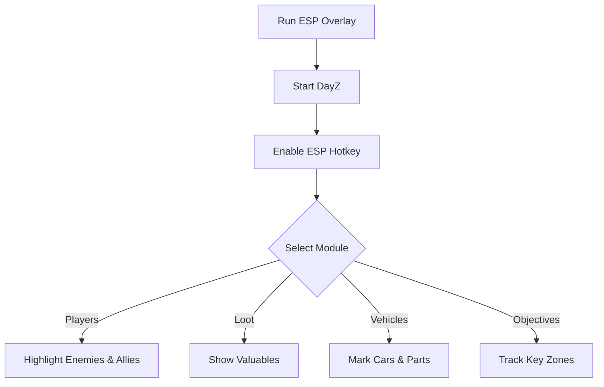

# DayZ ESP 👁️

The **DayZ ESP Overlay Software** is built for survivors who want sharper situational awareness. By displaying **players, loot, vehicles, and objectives** in real time, this tool makes it easier to plan strategies, avoid ambushes, and optimize loot runs.

[](#)
[](#)
[](#)
[](#)

---

## 📝 Overview

DayZ thrives on unpredictability—hidden enemies, scarce loot, and vehicle scarcity make every session intense. ESP overlays cut through the chaos, offering **clear markers and distance tracking** so you can focus on survival.

\[!IMPORTANT]
The ESP runs in memory only. It doesn’t modify game files and is best used for **offline or private server training**.

---

## ⭐ Features

* **Player ESP** – Show enemy and ally locations with names and distance.
* **Loot ESP** – Highlight weapons, medical items, and rare gear.
* **Vehicle ESP** – Mark cars, trucks, and repair parts across the map.
* **Custom Colors & Transparency** – Configure visuals for clarity.
* **Objective Markers** – Display key zones like tents, stashes, or bases.
* **Hotkey Toggles** – Enable/disable features instantly.

---

## 🖥 Compatibility

| Platform          | Supported | Notes                 |
| ----------------- | --------- | --------------------- |
| Windows 10/11     | ✅         | Fully supported       |
| Steam             | ✅         | Stable with overlay   |
| Console (Xbox/PS) | ❌         | Not supported         |
| Linux (Proton)    | ⚠️        | Partial compatibility |

\[!NOTE]
Accessibility: Fonts, line thickness, and color codes can be adjusted for better visibility.

---

## ⚡ Setup Guide

1. **Download** the DayZ ESP package.
2. Extract into your DayZ root directory.
3. Run `ESPOverlay.exe` as administrator.
4. Launch DayZ and press `INSERT` to activate the overlay.
5. Configure modules in the menu or `config.ini`.

```ini
[esp]
player=red
ally=green
vehicle=blue
loot=epic,rare,medical
objectives=yellow
show_distance=true
```

---

## 🔄 ESP Workflow



---

## ❓ FAQ

**Q: Does ESP affect FPS?**
A: Minimal impact—optimized for smooth rendering.

**Q: Can I customize colors?**
A: Yes, every overlay element is configurable.

**Q: Will it alter saves or inventory?**
A: No, it runs only in memory.

**Q: Does it work online?**
A: It’s intended for private or offline training only.

**Q: Can I toggle modules during gameplay?**
A: Yes, all modules can be switched on/off with hotkeys.

---

## 🚀 Final Thoughts

The **DayZ ESP Overlay Software** gives survivors powerful tools for **situational awareness**. With customizable highlights for players, loot, and vehicles, it’s the ideal training companion for mastering DayZ’s harsh world.

---


